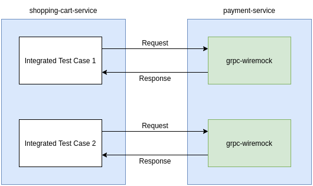

## Utilizando grpc-wiremock para mockar respostas em testes integrados de serviços gRPC

Este repositório possui um exemplo prático de como configurar e realizar testes integrados com respostas mockadas utilizando o [gRPC Wiremock](https://github.com/Adven27/grpc-wiremock)

Consulte também o artigo [Utilizando gRPC Wiremock para mockar respostas gRPC em testes integrados](https://tonyaugusto.medium.com/utilizando-grpc-wiremock-para-mockar-respostas-grpc-em-testes-integrados-289566a7bd98) para detalhes adicionais.

## Stack
- Micronaut gRPC;
- Kotlin;
- [gRPC Wiremock](https://github.com/Adven27/grpc-wiremock)

## Fluxo resumido



## Configurando um mock

Considere que o `shopping-cart-service` seja um microsservice que se comunica com o serviço `payment-service` e você precisa fazer testes integrados para o fluxo de sucesso
e de erro do shopping-cart-service. Neste caso, como os serviços se comunicam via gRPC, um serviço de mock REST comum não será suficiente e neste ponto que entra
o gRPC Wiremock.
Para configurar uma resposta mockada você deve seguir os seguintes passos:
- 1º Crie um diretório, por exemplo, **wiremock** e dentro dele crie um sub-diretório **proto** e coloque uma cópia dos arquivos .proto que definem
os serviços que deverão ser mockados;

- 2º Ainda dentro do diretório **wiremock** crie um sub-diretório chamado **stubs** e dentro de **stubs** crie outro sub-diretório chamado **mappings** (atenção a este ponto,
o sub-diretório mappings é **importante** para o gRPC Wiremock). Dentro de mappings adicione arquivos JSON com a definição da requisição que será enviada e a resposta que
deverá ser dada para aquela requisição. Um modelo básico ficaria assim:
```json
{
  "request": {
    "method": "POST",
    "url": "/PaymentService/pay",
    "bodyPatterns": [
      {
        "equalToJson": {
          "name": "any name",
          "cardNumber": "CARD-NUMBER-HERE",
          "value": 100.00
        }
      }
    ]
  },
  "response": {
    "status": 200,
    "jsonBody": {
      "status": "PAYMENT_ACCEPT"
    }
  }
}

```
O JSON acima significa que toda vez que uma requisição for feita no endereço onde o grp-wiremock está sendo executado com os dados contidos no bloco **request**
o bloco **response** definido será retornado. Os campos **name**, **cardNumber** e **value** devem ter os mesmos nomes e tipos de dados definidos no parâmetro 
de entrada do serviço `"/PaymentService/pay"`, o mesmo vale para os campos contidos na resposta.

## Como executar este exemplo

- Importe a pasta do projeto na sua IDE de preferência, no exemplo uso o Intellij Community;
- Feita a importação, execute a task `generateProto` do Gradle;
- No diretório raiz do repositório execute `docker-compose -f ./docker-compose-grpc-wiremock.yaml up --build` para que uma instância do gRPC Wiremock seja
inicializada;
- Acesse o pacote de testes **br.com.tony.shoppingcartservice.integration** e execute a classe **CreateOrderTestIT**
- Aguarde execução e pronto!
